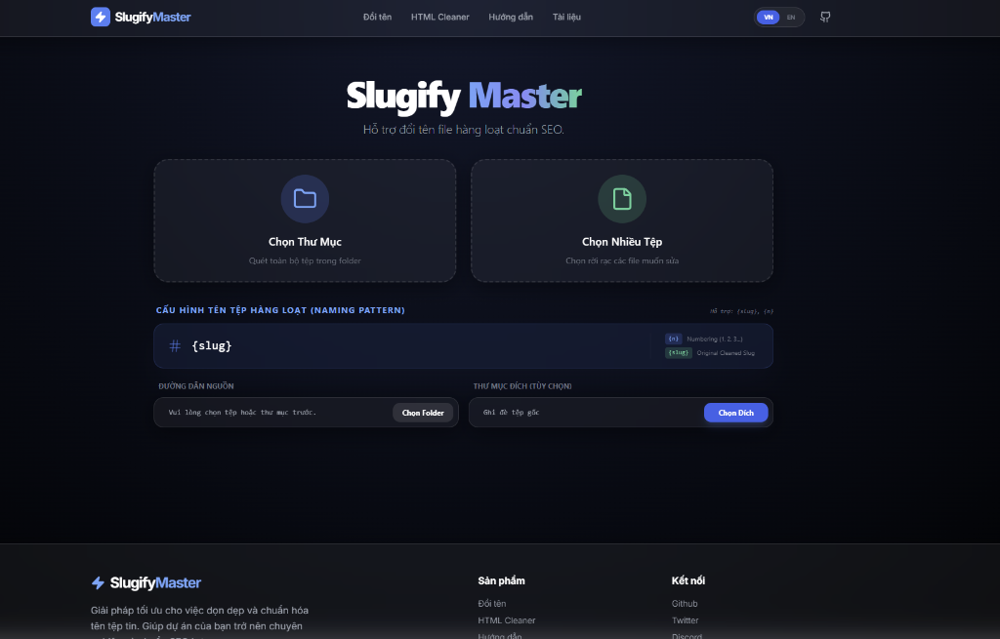
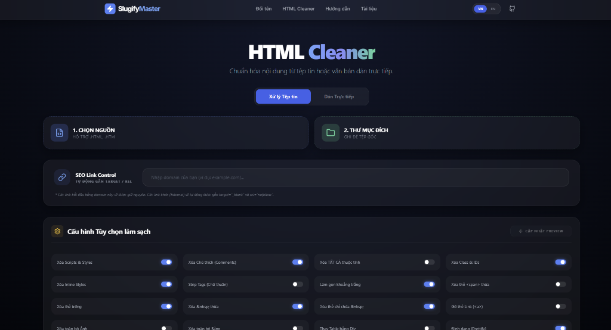
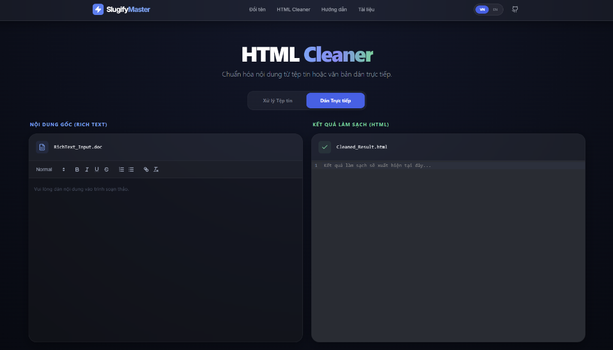

# ⚡ Slugify Master

**Slugify Master** is a powerful data normalization toolkit, featuring SEO-optimized bulk file renaming and professional HTML source code sanitization. The project is built with a modern architecture, adhering to SOLID principles and optimized for maximum performance.

[Tiếng Việt](README.md) | **English**

---

## 🚀 Key Features

### 1. Rename Tool (Slugify)
*   Batch rename files and folders.
*   Automatically remove accents (Vietnamese), convert to lowercase, and strip special characters.
*   Supports Naming Patterns: `{slug}` (original cleaned name) and `{n}` (auto-numbering).
*   High-speed Preview mode before applying actual changes.



### 2. HTML Cleaner (Source Sanitization)
*   **File Processing**: Scan and clean junk code in bulk HTML/HTM files.
*   **Direct Paste**: Convert content from Word, Websites (Rich Text) to normalized HTML code.
*   **SEO Link Control**: Automatically assign `target="_blank"` and `rel="nofollow"` to external links.
*   **Flexible Configuration**: Over 15 cleaning options (remove scripts, styles, classes, empty tags, replace tables with divs...).




---

## 🛠 Tech Stack

*   **Backend**: Python, FastAPI, BeautifulSoup4 (HTML processing logic).
*   **Frontend**: Next.js 14, Tailwind CSS, Lucide Icons, Framer Motion.
*   **Editor**: React Quill, CodeMirror (For source code preview).
*   **Architecture**: SOLID, Strategy Pattern, Client-Server separation.

---

## 📥 Installation

### 1. Prerequisites
*   Python 3.9+
*   Node.js 18+
*   NPM or Yarn

### 2. Backend Setup
```bash
cd backend
python -m venv venv
source venv/bin/activate  # On Windows: .\venv\Scripts\activate
pip install -r requirements.txt
python main.py
```
*Backend will run at: http://localhost:8000*

### 3. Frontend Setup
```bash
cd frontend
npm install
npm run dev
```
*Frontend will run at: http://localhost:3000*

---

## 📖 Usage Guide

1.  **Language Toggle**: Use the **VN/EN** switch in the Header to change the interface language.
2.  **File Renaming**:
    *   Select source folder or files.
    *   Enter a name pattern in the "Naming Pattern" box (e.g., `product-{n}`).
    *   Check the Preview table and click "Apply Changes".
3.  **HTML Cleaning**:
    *   Paste content into the left editor or select an HTML file.
    *   Configure cleaning options in the bottom panel.
    *   Click "Clean" and copy the optimized source code result.

---

## 🛡 Security & Optimization
*   Prevents **Directory Traversal** attacks via safe path validation.
*   Frontend optimized for SEO with full Metadata and Semantic HTML.
*   Uses **Fast Refresh** and **Dynamic Imports** for rapid response times.

---

**Made with ❤️ by Kim Thu**
